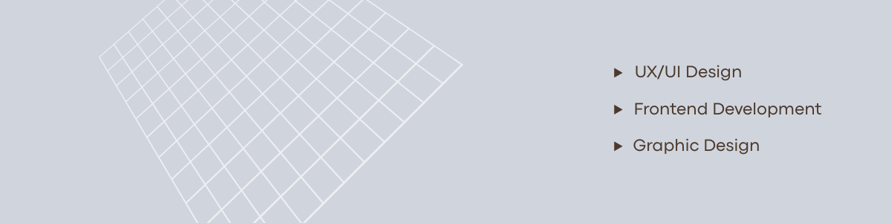
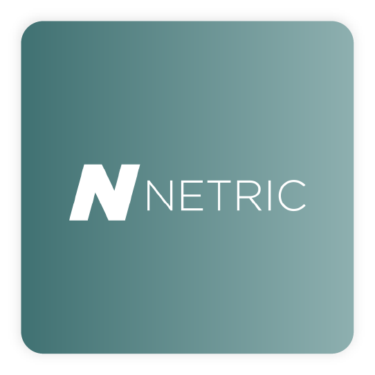
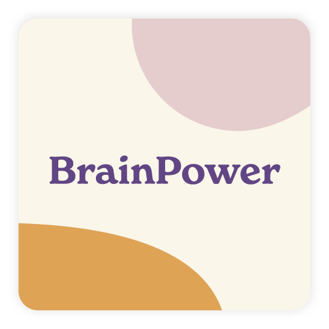

# Hi, I'm Siri 👋

I work at the intersection of UX, UI, and frontend development, with a strong background in graphic design.

## 💻 Tech Stack:
    

**🚀 Core Skills:** 
- UX design
- UI design
- Graphic Design
- WCAG and accessability
- HTML, CSS and Javascript

## 🧩 Selected Code Projects
- **🍸 [Recipe website for themed drinks](https://github.com/IlonaDuvbeniak/Recept-Website)** — Responsive web application with API integration, built using Vue, Vite, and Vue Router.
- **🎤 [Interview project page](https://github.com/Falusvampen/BootcampChasAcademy)** — Multi-page responsive website built with semantic HTML, CSS, and JavaScript.

## Selected Design Projects

  
  
  

## ⭐ Portfolio & Contact
 - 🎨 **[Design portfolio](https://siriprydz.wixsite.com/graphicdesign)**
 - 💼 **[Linkedin](https://www.linkedin.com/in/siriprydz/)**
   
## 🔭 Looking for internship
I am currently looking for an internship (LIA) as part of my education, where I can apply my UX, UI, and frontend skills, from November 9, 2026 to April 25, 2027.

<!--
**siriprydz/siriprydz** is a ✨ _special_ ✨ repository because its `README.md` (this file) appears on your GitHub profile.

Here are some ideas to get you started:

- 🔭 I’m currently working on ...
- 🌱 I’m currently learning ...
- 👯 I’m looking to collaborate on ...
- 🤔 I’m looking for help with ...
- 💬 Ask me about ...
- 📫 How to reach me: ...
- 😄 Pronouns: ...
- ⚡ Fun fact: ...
# 💫 About Me:
-->
